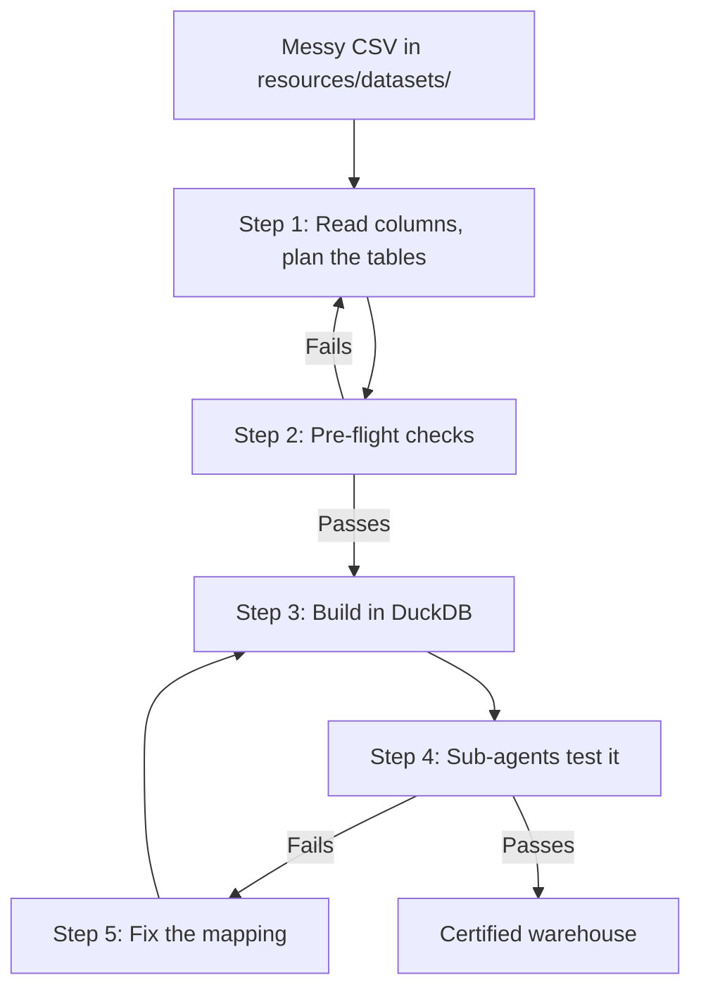

# How to Run — `olap_swifter`

This is the practical guide. Every command, file path, SQL template and code
example lives here.

If you want to understand *why* the model is built the way it is, read
[SKILL.md](SKILL.md) instead. If you want the test definitions, read
[TEST.md](TEST.md).

---

## Contents
1. [Set up the environment](#1-set-up-the-environment)
2. [Where the files live](#2-where-the-files-live)
3. [Run it as an agent (the full skill)](#3-run-it-as-an-agent-the-full-skill)
4. [Run it with plain DuckDB SQL](#4-run-it-with-plain-duckdb-sql)
5. [Run it from Python](#5-run-it-from-python)
6. [Run it from the command line](#6-run-it-from-the-command-line)
7. [Test the code tools](#7-test-the-code-tools)
8. [Run the full test suite](#8-run-the-full-test-suite)
9. [The datasets](#9-the-datasets)

---

## 1. Set up the environment

Everything is installed in the project virtual environment (`.venv`).

```bash
cd /Users/muwongekhalifan/Desktop/dexta_s_lab/olap_swifter
```

Check it works:

```bash
.venv/bin/python -c "import olap_swifter; print('olap_swifter is ready')"
```

If the environment does not exist yet, create it:

```bash
python3 -m venv .venv
source .venv/bin/activate
pip install -e resources/code_tools
```

---

## 2. Where the files live

| Path | What it holds |
| :--- | :--- |
| `resources/datasets/` | **All CSV datasets.** Every dataset you build from must be here. |
| `resources/code_tools/olap_swifter/` | The Python package (builder, validator, cube, profiler, CLI). |
| `resources/code_tools/olap_swifter/tests/` | The pytest suite. |
| `resources/clinical_warehouse.duckdb` | The DuckDB warehouse file, created when you build. |
| `model_reviewer.html` | The interactive review page. |

**Rule:** put new datasets in `resources/datasets/`. Nowhere else. The commands
and tests below all assume that path.

---

## 3. Run it as an agent (the full skill)

Point the agent at a dataset and let it work through the five steps in
[SKILL.md](SKILL.md).



What the agent actually does at each step:

**Step 1 — Read the data.** Ask DuckDB what is in the file:

```sql
DESCRIBE SELECT * FROM 'resources/datasets/sample_wide_clinical.csv';
SELECT * FROM 'resources/datasets/sample_wide_clinical.csv' LIMIT 5;
```

Then sort every column into one of these tables:

| Table | Typical columns |
| :--- | :--- |
| `dim_patient` | `patient_id`, `gender`, `age_group`, `location_district`, `substance_use_history` |
| `dim_facility` | `facility_id`, `facility_name`, `facility_level`, `district`, `region` |
| `dim_diagnosis` | `diagnosis_id`, `diagnosis_name`, `clinical_category`, `icd10_code` |
| `dim_medication` | `medication_id`, `medication_name`, `antibiotic_class`, `who_aware` |
| `dim_lab_test` | `test_id`, `test_name`, `specimen_type` |
| `dim_visit` *(the spine)* | `visit_id`, `patient_id`, `facility_id`, `visit_date`, `visit_type`, `admission_ward` |
| `fact_encounters` | `visit_id`, `encounter_cost_ugx`, `length_of_stay_days`, `prior_antibiotic_use_30d` |
| `fact_prescriptions` | `visit_id`, `medication_id`, `drug_cost_ugx`, `drug_administration_route`, `dose_mg` |
| `fact_lab_results` | `visit_id`, `organism_name`, `tested_antibiotic`, `mic_ug_ml`, `zone_diameter_mm`, `ast_interpretation`, `is_mdr_isolate` |

**Step 2 — Pre-flight checks.** Run these before creating anything:

```sql
-- Gate 1: no empty visit keys
SELECT COUNT(*) FROM 'resources/datasets/sample_wide_clinical.csv' WHERE visit_id IS NULL;
-- must return 0

-- Gate 2: susceptibility codes are only S, I, R or empty
SELECT DISTINCT ast_interpretation FROM 'resources/datasets/sample_amr_clinical.csv';
-- must be a subset of {'S', 'I', 'R', NULL}
```

Gate 3 (every raw column is mapped) is checked in code — see
[section 7](#7-test-the-code-tools).

**Step 3 — Build.** Use the SQL in [section 4](#4-run-it-with-plain-duckdb-sql)
or the CLI in [section 6](#6-run-it-from-the-command-line).

**Step 4 — Test.** Spawn the sub-agents defined in [TEST.md](TEST.md).

**Step 5 — Fix and rebuild.** Take the failing query, adjust the
`CREATE OR REPLACE TABLE ... AS SELECT`, rebuild, re-run that sub-agent.

---

## 4. Run it with plain DuckDB SQL

No scripts needed. Open DuckDB and run the statements in order: stage → 
dimensions → visit spine → facts.

### Option A — Wide clinical dataset

```sql
-- 1. Stage the raw file
CREATE OR REPLACE TABLE raw_clinical_records AS
SELECT * FROM 'resources/datasets/sample_wide_clinical.csv';

-- 2. Dimensions
CREATE OR REPLACE TABLE dim_patient AS
SELECT DISTINCT patient_id, gender, age_group, location_district, substance_use_history
FROM raw_clinical_records WHERE patient_id IS NOT NULL;

CREATE OR REPLACE TABLE dim_facility AS
SELECT DISTINCT facility_id, facility_name, facility_level
FROM raw_clinical_records WHERE facility_id IS NOT NULL;

CREATE OR REPLACE TABLE dim_diagnosis AS
SELECT DISTINCT diagnosis_id, diagnosis_name, clinical_category
FROM raw_clinical_records WHERE diagnosis_id IS NOT NULL;

CREATE OR REPLACE TABLE dim_medication AS
SELECT DISTINCT medication_id, medication_name, antibiotic_class
FROM raw_clinical_records WHERE medication_id IS NOT NULL;

-- 3. The visit spine
CREATE OR REPLACE TABLE dim_visit AS
SELECT DISTINCT visit_id, patient_id, facility_id, visit_date, visit_type, admission_ward
FROM raw_clinical_records WHERE visit_id IS NOT NULL;

-- 4. Facts, each anchored on visit_id
CREATE OR REPLACE TABLE fact_encounters AS
SELECT visit_id, patient_id, length_of_stay_days, encounter_cost_ugx, prior_antibiotic_use_30d
FROM raw_clinical_records;

CREATE OR REPLACE TABLE fact_prescriptions AS
SELECT visit_id, patient_id, medication_id, drug_cost_ugx, drug_administration_route
FROM raw_clinical_records WHERE medication_id IS NOT NULL;

CREATE OR REPLACE TABLE fact_lab_results AS
SELECT visit_id, patient_id, test_id, ast_interpretation, zone_diameter_mm
FROM raw_clinical_records WHERE test_id IS NOT NULL;
```

### Option B — AMR surveillance dataset

```sql
-- 1. Stage the raw file
CREATE OR REPLACE TABLE raw_clinical_records AS
SELECT * FROM 'resources/datasets/sample_amr_clinical.csv';

-- 2. Dimensions
CREATE OR REPLACE TABLE dim_patient AS
SELECT DISTINCT patient_id, gender, age_group, location_district, substance_use_history
FROM raw_clinical_records WHERE patient_id IS NOT NULL;

CREATE OR REPLACE TABLE dim_facility AS
SELECT DISTINCT facility_id, facility_name, facility_level
FROM raw_clinical_records WHERE facility_id IS NOT NULL;

-- 3. The visit spine
CREATE OR REPLACE TABLE dim_visit AS
SELECT DISTINCT visit_id, patient_id, facility_id, visit_date, admission_ward
FROM raw_clinical_records WHERE visit_id IS NOT NULL;

-- 4. Facts
CREATE OR REPLACE TABLE fact_encounters AS
SELECT visit_id, patient_id, length_of_stay_days, encounter_cost_ugx, prior_antibiotic_use_30d
FROM raw_clinical_records;

CREATE OR REPLACE TABLE fact_lab_results AS
SELECT
    visit_id, patient_id, specimen_type, organism_name, tested_antibiotic,
    antibiotic_class, mic_ug_ml, zone_diameter_mm, ast_interpretation, is_mdr_isolate
FROM raw_clinical_records;
```

---

## 5. Run it from Python

```python
import pandas as pd
from olap_swifter.builder import DynamicOLAPBuilder
from olap_swifter.validator import SemanticDataValidator

# 1. Load a dataset and build the constellation schema in DuckDB
df = pd.read_csv("resources/datasets/sample_amr_clinical.csv")
builder = DynamicOLAPBuilder()
builder.register_raw_data(df)
builder.generate_olap_tables("constellation")

# 2. Check no column was dropped
all_mapped, missing = builder.verify_no_variable_left_out()
print(f"Zero variable loss: {all_mapped} (missing: {missing})")

# 3. Check the totals still match the raw file
validator = SemanticDataValidator(conn=builder.conn, raw_table="raw_clinical_records")
sum_res = validator.validate_metric_sum("encounter_cost_ugx", "fact_encounters")
print(f"Cost totals match: {sum_res.passed}")

# 4. Ask a clinical question
amr_df = builder.conn.execute("""
    SELECT
        organism_name,
        ast_interpretation,
        COUNT(*) AS count,
        ROUND(COUNT(*) * 100.0 / SUM(COUNT(*)) OVER (PARTITION BY organism_name), 1) AS pct
    FROM fact_lab_results
    GROUP BY organism_name, ast_interpretation
    ORDER BY organism_name, ast_interpretation;
""").df()
print(amr_df)
```

---

## 6. Run it from the command line

```bash
# Build from the wide clinical dataset
.venv/bin/python -m olap_swifter.cli build --csv resources/datasets/sample_wide_clinical.csv

# Build from the AMR surveillance dataset
.venv/bin/python -m olap_swifter.cli build --csv resources/datasets/sample_amr_clinical.csv

# Build a synthetic benchmark of 500 visits
.venv/bin/python -m olap_swifter.cli build --visits 500

# Profile join paths, deepest cube slices and query latency
.venv/bin/python -m olap_swifter.cli profile

# Generate the interactive review page (model_reviewer.html)
.venv/bin/python -m olap_swifter.cli review

# Drive the review page with Playwright and capture screenshots
.venv/bin/python -m olap_swifter.cli verify-ui
```

---

## 7. Test the code tools

Each module can be exercised on its own.

### The builder — `DynamicOLAPBuilder`
Checks that columns get classified, nothing is dropped, and fields can be moved
between tables.

```python
import pandas as pd
from olap_swifter.builder import DynamicOLAPBuilder

df = pd.read_csv("resources/datasets/sample_wide_clinical.csv")
builder = DynamicOLAPBuilder()
builder.register_raw_data(df, table_name="raw_clinical_records")

# No column left behind
all_mapped, missing = builder.verify_no_variable_left_out()
assert all_mapped is True and len(missing) == 0

# Move a field to a different table
builder.switch_field("gender", "dim_patient_demographics", new_role="dimension_attribute")
inv = {f["name"]: f for f in builder.get_field_inventory()}
assert inv["gender"]["target_table"] == "dim_patient_demographics"
```

### The validator — `SemanticDataValidator`
Checks row counts and metric totals against the raw staging table.

```python
from olap_swifter.validator import SemanticDataValidator

validator = SemanticDataValidator(conn=builder.conn, raw_table="raw_clinical_records")

count_res = validator.validate_row_counts("dim_visit")
assert count_res.passed is True

sum_res = validator.validate_metric_sum("encounter_cost_ugx", "fact_encounters")
assert sum_res.passed is True
```

### The cube and slicer — `MedicalCube`, `CubeSlicer`
Checks multi-dimensional slicing, roll-ups and finding the deepest populated
slices.

```python
from olap_swifter.olap.cube import MedicalCube
from olap_swifter.profiler.slicer import CubeSlicer

cube = MedicalCube(conn=builder.conn)
slicer = CubeSlicer(conn=builder.conn)

slice_res = cube.slice_and_dice(
    dimensions=["v.visit_type", "p.age_group"],
    measures=["COUNT(*) AS visit_count", "SUM(e.encounter_cost_ugx) AS total_cost"],
)
assert len(slice_res) > 0

deep_slices = slicer.dig_deepest_slices(
    base_from_clause=(
        "fact_encounters e "
        "JOIN dim_visit v ON e.visit_id = v.visit_id "
        "JOIN dim_patient p ON v.patient_id = p.patient_id"
    ),
    candidate_dimensions=["v.visit_type", "p.age_group", "p.location_district"],
    metric_sql="COUNT(*)",
    min_depth=2,
    max_depth=3,
)
assert len(deep_slices) > 0
```

### The join graph and latency profiler — `JoinGraph`, `LatencyProfiler`
Checks shortest join paths and query timings.

```python
from olap_swifter.profiler.join_graph import JoinGraph
from olap_swifter.olap.constellation import get_constellation_schema_metadata
from olap_swifter.profiler.latency import LatencyProfiler

graph = JoinGraph()
graph.load_from_metadata(get_constellation_schema_metadata())
path = graph.get_join_path("fact_encounters", "dim_facility")
assert path == ["fact_encounters", "dim_facility"] or "dim_visit" in path

profiler = LatencyProfiler(conn=builder.conn)
profile_res = profiler.profile_query("SELECT COUNT(*) FROM fact_encounters", label="Encounter Count")
assert profile_res.avg_duration_ms >= 0.0
```

---

## 8. Run the full test suite

Everything at once:

```bash
.venv/bin/pytest -v
```

Or one module at a time:

```bash
# Datasets, pre-flight gates and AMR S/I/R queries
.venv/bin/pytest -v resources/code_tools/olap_swifter/tests/test_dynamic_datasets.py

# Zero variable loss and semantic validation
.venv/bin/pytest -v resources/code_tools/olap_swifter/tests/test_builder_and_validator.py

# Cube slicing, roll-ups and pivots
.venv/bin/pytest -v resources/code_tools/olap_swifter/tests/test_cube.py

# Join graph distances and latency profiling
.venv/bin/pytest -v resources/code_tools/olap_swifter/tests/test_profiler.py

# The full end-to-end pipeline
.venv/bin/pytest -v resources/code_tools/olap_swifter/tests/test_orchestrator.py
```

---

## 9. The datasets

All datasets live in **`resources/datasets/`**.

| File | Rows | Columns | What is in it |
| :--- | :--- | :--- | :--- |
| `sample_wide_clinical.csv` | 158 | 26 | Patient demographics, `substance_use_history`, `prior_antibiotic_use_30d`, `drug_administration_route`, diagnoses, encounters and costs. |
| `sample_amr_clinical.csv` | 200 | 22 | Organism identification, susceptibility results (`S`, `I`, `R`), `mic_ug_ml`, `zone_diameter_mm`, `is_mdr_isolate`, prior antibiotic exposure. |

To add your own dataset, drop the CSV into `resources/datasets/` and pass it to
the build command:

```bash
.venv/bin/python -m olap_swifter.cli build --csv resources/datasets/your_dataset.csv
```
