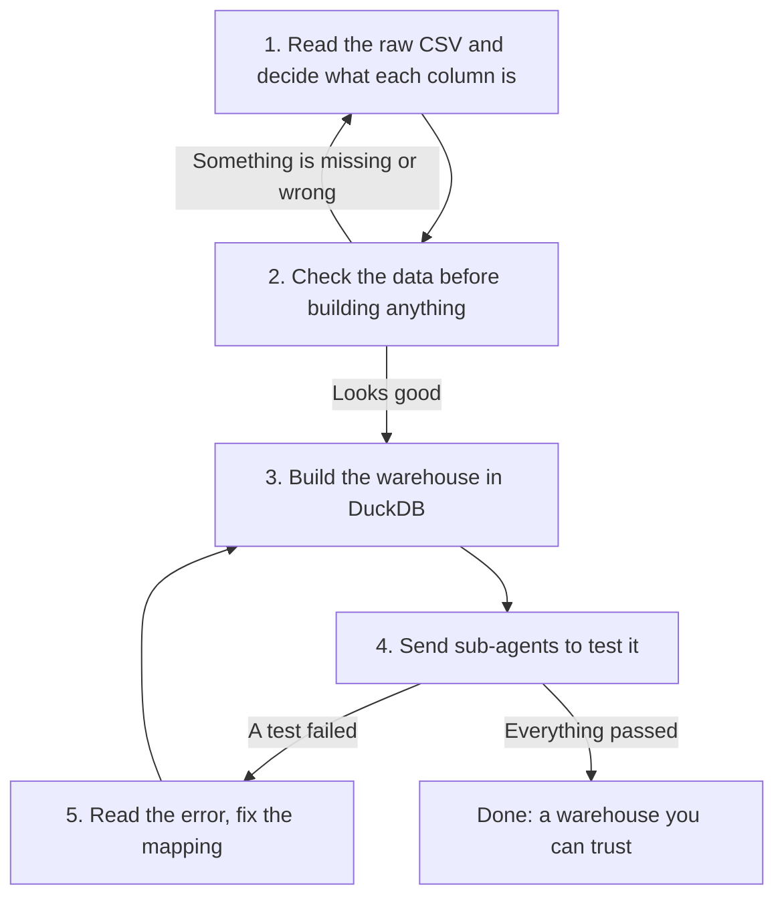

# Medical OLAP Orchestrator

This skill teaches the agent **how to think** about turning wide, messy clinical
data into a trustworthy OLAP warehouse.

It is the *what* and *why*. The *how* lives in two companion files:

- **[HOW_TO_RUN.md](HOW_TO_RUN.md)** — every command, SQL template, code tool and
  file path. Read it when you are ready to actually run something.
- **[TEST.md](TEST.md)** — the sub-agent test prompts and their pass conditions.

Do not put commands or paths in this file. Keep them in `HOW_TO_RUN.md`.

---

## 1. The Rules That Must Never Be Broken

### Rule 1 — Zero Variable Loss
Every single column in the raw file must end up somewhere: either as an
attribute on a **dimension** (something that describes an entity) or as a
measure or key on a **fact** (something that happened, or something measured).

Never drop a column because it looks unimportant. In clinical surveillance, a
dropped column changes the answer.

### Rule 2 — The Visit Is the Spine
In medicine, nothing happens on its own. A diagnosis, a drug, a lab result, a
vital sign — each one happens **during a visit**. So the visit dimension is the
centre of the model, and every fact table joins back to it.

```
                      +-------------------+
                      |    dim_patient    |
                      +---------+---------+
                                |
                      +---------v---------+
                      |     dim_visit     |
                      |   (Visit Spine)   |
                      +----+----+----+----+
                           |    |    |
           +---------------+    |    +----------------+
           |                    |                     |
+----------v---------+ +--------v--------+ +----------v---------+
|  fact_encounters   | |  fact_diagnoses | | fact_prescriptions |
+--------------------+ +-----------------+ +--------------------+
```

If a fact row has no visit, the model is wrong. Fix the model, not the data.

### Rule 3 — The Numbers Must Still Add Up
After the data is split into many tables, the totals must match the original
file. A sum, an average and a row count on the warehouse must equal the same
thing on the raw data. If they don't, the split was wrong.

---

## 2. The Three Schemas to Build

Build them in this order. Each one is a step up in detail.

| Level | Schema | What it is | Use it for |
| :--- | :--- | :--- | :--- |
| 1 | **Star** | One wide fact table, dimensions hanging off it. | Fast, simple, top-level reporting. |
| 2 | **Snowflake** | Same, but dimensions are normalised into hierarchies (district → region). | Cleaner drill-down paths. |
| 3 | **Fact Constellation** *(the main one)* | Several fact tables sharing the same dimensions, all anchored on the visit spine. | Real clinical analysis across encounters, drugs and labs. |

The Fact Constellation is the goal. The other two are stepping stones and
cross-checks.

---

## 3. How the Agent Works Through a Dataset



### Step 1 — Read and classify
Look at the real column names and a few real rows. Then decide, column by
column, where each one belongs:

- Does it **describe a person, place or thing**? → dimension attribute.
- Does it **record an event or a measurement**? → fact.
- Does it **identify the encounter**? → the visit spine.

Group columns that describe the same entity into the same dimension. Group
measurements taken at the same moment into the same fact.

### Step 2 — Check before you build
Run the pre-flight gates. Nothing gets created until these pass:

1. Every raw column is accounted for in the plan.
2. The visit key is never empty.
3. Coded clinical values use only their allowed codes (for example, antibiotic
   susceptibility results should only ever be `S`, `I`, `R` or empty).

If a gate fails, go back to Step 1. Do not build on top of a known problem.

### Step 3 — Build it
Load the raw file into a staging table, then create the dimensions, then the
visit spine, then the facts. Always in that order, because each layer depends
on the one before it.

### Step 4 — Prove it with sub-agents
Don't mark the job done yourself. Hand the checking to specialised sub-agents,
each with one job:

| Sub-agent | What it proves |
| :--- | :--- |
| `pre_etl_validator` | The raw data was fit to build on. |
| `relational_integrity_auditor` | No fact row is orphaned; entity counts survived. |
| `metric_parity_verifier` | Sums and averages still match the raw file. |
| `clinical_research_query_agent` | Real clinical questions return sensible answers. |

The mandates, methods and pass conditions for each are in [TEST.md](TEST.md).

Sub-agents are not limited to a fixed list of checks. They hold the raw staging
table, which is the source of truth for the dataset in front of them, so they
can invent a test *and* work out its correct answer on their own. Expect them to
do that, and expect them to say which tests they wrote themselves.

### Step 5 — Fix and repeat
When a sub-agent reports a failure:

1. Take the **exact** error message and the query that produced it.
2. Work out which mapping decision caused it.
3. Change the table definition and rebuild.
4. Run that same sub-agent again.

Repeat until every test passes. A partly passing model is a failing model.

---

## 4. Traps to Watch For

- **Fan-out.** Joining two fact tables through the visit multiplies rows and
  inflates totals. Reduce to distinct rows before summing.
- **Silent deduplication.** `SELECT DISTINCT` when building a dimension can
  merge two real entities that share a key. Check the counts afterwards.
- **Sneaky nulls.** A null key turns into a lost row at join time. Catch nulls
  at the gate, not after the build.
- **Float drift.** Compare sums and averages with a small tolerance, not exact
  equality.

---

## 5. When You Are Ready to Run

Everything practical — environment setup, DuckDB SQL templates, the Python code
tools, the CLI commands and the test suite — is in
**[HOW_TO_RUN.md](HOW_TO_RUN.md)**.
