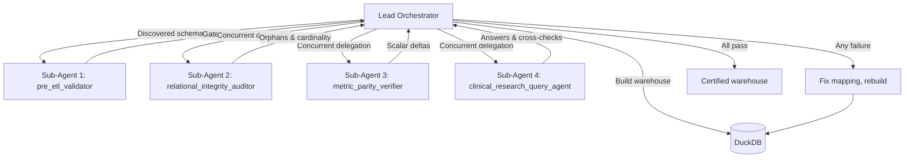

# Semantic Test Suite (`TEST.md`)

This file defines **what must be proven** about a generated OLAP warehouse —
not how to prove it for any one dataset.

There are no fixed column names here, no fixed table names and no ready-made
SQL. The skill is a context-aware ETL: it discovers the schema at run time, so
the tests must be discovered at run time too. Each sub-agent is given an
objective and works out its own queries against whatever schema actually exists.

The sub-agents are expected to **write tests of their own**. They hold the raw
staging table, which is the source of truth for this dataset, so they can both
invent a check and compute its correct answer without anyone supplying one.
[Section 4](#4-generating-a-test-and-its-expected-value) is the method. The
tests listed afterwards are worked examples of that method, not its limit.

Read [SKILL.md](SKILL.md) for the modelling rules. Read
[HOW_TO_RUN.md](HOW_TO_RUN.md) for commands and environment.

---

## 1. The One Rule That Makes This Work

**The raw staging table is the only oracle.**

Never write an expected number into a test. You do not know, in advance, how
many patients a file contains or what the total cost comes to — and if you hard
code a guess, the test proves nothing.

Instead, every expectation is **computed from the raw data at test time**:

```
expected  :=  <the same question, asked of the raw staging table>
actual    :=  <the same question, asked of the warehouse>
pass      :=  actual agrees with expected
```

The warehouse is a rearrangement of the raw file. Any question answerable from
both must give the same answer. That is the whole test suite.

---

## 2. The Four Mandates

Each sub-agent exists to prove one thing. These mandates are fixed; the tests
that satisfy them are not.

| Sub-agent | What it must prove |
| :--- | :--- |
| `pre_etl_validator` | The raw data was fit to build on. |
| `relational_integrity_auditor` | No fact row is orphaned; entity counts survived. |
| `metric_parity_verifier` | Sums and averages still match the raw file. |

| `clinical_research_query_agent` | Real clinical questions return sensible answers. |

Read the mandate as the objective and the tests below as **worked examples of
how to satisfy it** — not as a checklist to tick off. A sub-agent that finds a
better way to prove its mandate against the schema in front of it should take
it, and say so in its report.

---

## 3. How Sub-Agents Get Their Targets

Before any sub-agent runs, the orchestrator hands it the **discovered schema
context**:

| Context item | Meaning |
| :--- | :--- |
| `raw_table` | The staging table holding the unmodified source rows. |
| `spine_table` / `spine_key` | The encounter dimension and its key. |
| `dimensions` | Each dimension table, its entity key, and its attributes. |
| `facts` | Each fact table, its foreign keys, and its numeric measures. |
| `coded_columns` | Columns whose values are drawn from a fixed vocabulary, with the vocabulary observed in the raw data. |

A sub-agent never assumes a name. It reads this context, or asks the database
directly, then writes its own queries. Where a template appears below,
everything in `<angle brackets>` is filled from the context — it is a *shape*,
not a query.

---

## 4. Generating a Test and Its Expected Value

A sub-agent is not limited to the tests written in this file. It has the schema
and it has the oracle, so it can **author new tests** — and, crucially, it can
work out the right answer to each one without being told.

This is the part that makes the suite context-aware. Follow it whenever the
listed tests do not cover something the schema makes possible.

### Step 1 — Find something that must be true

Look at the schema and ask what the rearrangement could have broken. Useful
places to look:

- A column moved from the raw file into a dimension → its values must be unchanged.
- A numeric column that became a measure → its total, average and spread must be unchanged.
- A key that became a foreign key → it must still resolve.
- A categorical column → its value distribution must be unchanged.
- Two facts sharing a parent → joining them must not inflate anything.

Each of these is an invariant. Any invariant you can state in one sentence, you
can test.

### Step 2 — Write the question so both sides can answer it

A test only works if the same question can be put to the raw table and to the
warehouse. Phrase it once, in plain language, then translate it twice:

```
Question:   "What is the total <measure>, broken down by <attribute>?"

Against raw:        one table, columns read directly.
Against warehouse:  the fact holding <measure>, joined out to the dimension
                    holding <attribute>.
```

If a question can only be asked of one side, it is not a parity test. It may
still be a useful sanity check — label it as such and do not claim it proves
equivalence.

### Step 3 — Compute the expected value, never assume it

Run the raw version **first**, and take whatever it returns as the expectation.
That number is the truth for this dataset and this run.

```sql
-- shape: the oracle and the subject in one statement, so they cannot drift
WITH expected AS ( <the question, asked of the raw table> ),
     actual   AS ( <the same question, asked of the warehouse> )
SELECT * FROM expected FULL OUTER JOIN actual USING (<group keys>)
WHERE <values differ beyond tolerance>;
```

Asking both sides in one statement is worth the effort: it removes any chance of
comparing against a stale number from an earlier build.

### Step 4 — Choose a tolerance, and justify it

- **Counts and keys** — exact. No tolerance.
- **Floating-point measures** — relative tolerance, roughly `1e-9`.
- **Currency and large-magnitude values** — a small absolute tolerance is more
  honest than a relative one; state the value used.
- **Averages over different row counts** — if the counts differ, the averages
  are *supposed* to differ. Compare the counts first and report that instead.

Always record which tolerance was applied and why. A pass at the wrong tolerance
is not a pass.

### Step 5 — Make the failure useful

A test that reports only `FAIL` costs a whole reiteration cycle. Before
returning, collect:

- the rows that disagree, not just the count of them,
- the ratio between actual and expected — near a whole number points at
  fan-out, near zero at a filter,
- whether the build applied a `WHERE` clause the raw side did not.

### Step 6 — Check the test before blaming the model

When a generated test fails, one of two things is wrong, and they are about
equally likely:

- **The model is wrong** — the mapping lost or duplicated something.
- **The test is wrong** — usually the oracle side ignored a filter the build
  applied, or grouped on an attribute that is not unique per entity.

Re-derive the expected value once, deliberately, before reporting a model
defect.

---

## 5. The Testing Workflow



---

## 6. Sub-Agent 1 — `pre_etl_validator`

Runs **before** anything is created. Its job is to refuse to build on bad data.

### Gate 1 — Nothing gets left behind
- **Objective:** every column in the raw file appears in at least one planned
  table.
- **How to derive:** list the raw columns from the database, list the columns
  named across the build plan, compare the two sets.
- **Pass:** the set of unmapped raw columns is empty.
- **Report:** the names of any unmapped columns.

### Gate 2 — The spine key is complete
- **Objective:** the column chosen as the encounter spine identifies every row.
- **How to derive:** once the spine key is chosen, count rows where it is null
  or blank.
- **Pass:** zero.
- **Report:** the null count, and a sample of offending rows.

```sql
-- shape
SELECT COUNT(*) FROM <raw_table> WHERE <spine_key> IS NULL;
```

### Gate 3 — Keys are keys
- **Objective:** a column used as an entity key actually identifies one entity.
- **How to derive:** for each proposed dimension key, check that each key value
  carries a single consistent set of attribute values across the raw rows.
- **Pass:** no key value maps to two different attribute combinations.
- **Report:** the key, the attribute that disagrees, and an example conflict.

> This is the check that catches silent deduplication *before* it happens. If a
> key fails here, `SELECT DISTINCT` will quietly merge two real entities later.

### Gate 4 — Coded values stay inside their vocabulary
- **Objective:** categorical columns contain only values the data itself
  supports.
- **How to derive:** the agent does **not** start from a known code list. It
  profiles each low-cardinality column, reads the observed distinct values, and
  decides whether that set looks like a deliberate vocabulary (few values, high
  repetition) or free text. For a vocabulary, it records the observed set as the
  baseline and flags anything that deviates in casing, whitespace, or obvious
  typo distance from a dominant value.
- **Pass:** no value falls outside the observed vocabulary once normalised.
- **Report:** the column, its inferred vocabulary, and each deviant value with
  its row count.

> Example of the reasoning, not a rule to hard code: a column with three
> dominant values and four rows carrying a lowercase or padded variant of one of
> them is a normalisation problem, not four new categories.

### Gate 5 — Measures are measurable
- **Objective:** columns treated as numeric measures really are numeric.
- **How to derive:** for each proposed measure, check the column type and count
  values that fail to cast.
- **Pass:** zero uncastable non-null values.
- **Report:** the column and sample bad values.

---

## 7. Sub-Agent 2 — `relational_integrity_auditor`

Runs after the build. Its job is to prove the pieces still connect.

### Test 1 — No orphan rows
- **Objective:** every fact row links to a row in the table it references.
- **How to derive:** enumerate every foreign key in every fact table from the
  schema context. For each one, left-join to its parent and count misses. Do
  this for *all* of them — do not stop at the spine.
- **Pass:** every orphan count is zero.
- **Report:** a row per relationship: child table, parent table, key, orphan
  count.

```sql
-- shape, run once per (fact, foreign key, parent) triple
SELECT COUNT(*) FROM <fact_table> f
LEFT JOIN <parent_table> p ON f.<fk> = p.<parent_key>
WHERE p.<parent_key> IS NULL;
```

### Test 2 — Entity counts survived
- **Objective:** splitting the file did not create or lose entities.
- **How to derive:** for each dimension, compare its row count to the count of
  distinct non-null key values in the raw table.
- **Pass:** the two counts are equal for every dimension.
- **Report:** dimension, raw distinct count, built count, difference.

> A built count **above** the raw distinct count means the dimension is not
> deduplicated on its key — usually an attribute that varies per row got pulled
> into the dimension. A count **below** means rows were filtered out.

### Test 3 — Coverage of the spine
- **Objective:** every encounter in the raw file exists in the spine, and the
  spine invents nothing.
- **How to derive:** compare the distinct spine-key values in the raw table with
  those in the spine table, in both directions.
- **Pass:** both difference sets are empty.
- **Report:** counts missing from the spine, and counts present only in it.

### Test 4 — Attribute fidelity
- **Objective:** an attribute's values did not change when it moved into a
  dimension.
- **How to derive:** pick each dimension attribute, compare its value
  distribution (value, count of distinct entities) in the raw table against the
  dimension. Sample rather than exhaust if the table is wide.
- **Pass:** distributions match.
- **Report:** attribute, and any value whose count differs.

---

## 8. Sub-Agent 3 — `metric_parity_verifier`

Its job is to prove the arithmetic survived. **Every expected value here is
computed from `raw_table` in the same query.**

### Test 5 — Sum parity, for every measure found
- **Objective:** totals are unchanged.
- **How to derive:** the agent does not receive a list of measures to test. It
  enumerates the numeric columns of each fact table from the schema context and
  tests **all** of them.
- **Pass:** for each measure, the absolute difference is within tolerance
  (relative tolerance around `1e-9`, or an absolute `1e-3` for currency-scale
  values — choose based on the magnitude observed, and state which you used).
- **Report:** measure, raw total, warehouse total, delta, tolerance applied.

```sql
-- shape
SELECT
  (SELECT SUM(<measure>) FROM <raw_table>)     AS expected,
  (SELECT SUM(<measure>) FROM <fact_table>)    AS actual,
  ABS((SELECT SUM(<measure>) FROM <raw_table>)
    - (SELECT SUM(<measure>) FROM <fact_table>)) AS delta;
```

> **Watch the filter.** If a fact table was built with a `WHERE` clause, the raw
> side of the comparison must carry the same clause. Comparing a filtered fact
> to an unfiltered raw total is a false failure — and reporting it as a real one
> wastes a whole reiteration cycle.

### Test 6 — Average and distribution parity
- **Objective:** the shape of each measure is unchanged, not just its total.
- **How to derive:** for each measure, compare `AVG`, `MIN`, `MAX`, and the
  count of non-null values between raw and warehouse.
- **Pass:** all within tolerance.
- **Report:** measure, statistic, expected, actual, delta.

> Averages catch what sums miss. A sum can match while rows were duplicated and
> nulls introduced in equal measure; the average and the non-null count will not
> both survive that.

### Test 7 — Group-by parity
- **Objective:** slicing by a dimension attribute gives the same answer as
  slicing the raw file.
- **How to derive:** choose attributes with useful cardinality (more than one
  value, not unique per row). Group the raw table by the attribute; group the
  warehouse by the same attribute reached through its joins; compare the two
  result sets group by group.
- **Pass:** identical group keys, identical counts and totals.
- **Report:** attribute, and any group whose value differs.

### Test 8 — Fan-out does not inflate
- **Objective:** joining two fact tables through a shared parent does not
  multiply rows.
- **How to derive:** for each pair of fact tables sharing a parent, total a
  measure from one of them across the joined result, then compare against that
  measure's raw total.
- **Pass:** the joined total equals the raw total — not a multiple of it.
- **Report:** the fact pair, the measure, the joined total, the raw total, and
  the ratio between them.

```sql
-- shape: collapse to one row per parent before aggregating
SELECT SUM(<measure>) FROM (
  SELECT DISTINCT p.<parent_key>, a.<measure>
  FROM <parent_table> p
  JOIN <fact_a> a ON p.<parent_key> = a.<fk>
  LEFT JOIN <fact_b> b ON p.<parent_key> = b.<fk>
);
```

> A ratio that lands near a whole number is the signature of fan-out: the total
> was multiplied by the average number of matching child rows.

---

## 9. Sub-Agent 4 — `clinical_research_query_agent`

Its job is to prove the warehouse is *usable*, not just internally consistent. A
model can pass every parity check and still be impossible to query.

### Test 9 — Compose questions from the schema
- **Objective:** the warehouse answers real analytical questions.
- **How to derive:** the agent **writes its own questions** from the schema it
  finds. A workable recipe:
  - one measure from a fact table, aggregated,
  - grouped by one or two attributes from dimensions reachable by joins,
  - optionally filtered by a third.

  Build several across different fact tables and different join depths,
  including at least one that crosses from a fact, through the spine, to a
  dimension that fact does not reference directly.
- **Pass:** every query executes, returns rows, and the totals reconcile to the
  raw file when the same question is asked there.
- **Report:** each question in plain language, its SQL, its result, and the
  raw-data cross-check.

### Test 10 — Proportions are coherent
- **Objective:** breakdowns behave like breakdowns.
- **How to derive:** for each categorical attribute, compute each value's share
  within its group using a window function.
- **Pass:** shares sum to 100% per group, and match the shares computed on the
  raw file.
- **Report:** attribute, group, and any group whose shares do not close.

### Test 11 — Joins are reachable and short
- **Objective:** any dimension can be reached from any fact.
- **How to derive:** build the join graph from the schema context and check that
  every fact–dimension pair is connected; note the path length.
- **Pass:** no unreachable pair.
- **Report:** any disconnected pair, and any path longer than expected for the
  schema level being built.

---

## 10. Reporting Format

Every sub-agent returns the same structure, whatever it tested:

```
TEST:       <what invariant was being proven>
DERIVED:    <the targets it chose, and how it chose them>
QUERY:      <the SQL it actually ran>
EXPECTED:   <value computed from the raw table, and the query that computed it>
ACTUAL:     <value from the warehouse>
TOLERANCE:  <exact | relative 1e-9 | absolute 1e-3>, and why
RESULT:     PASS | FAIL
DETAIL:     <on failure: the offending rows, and the actual/expected ratio>
ORIGIN:     listed | generated
```

`DERIVED` matters as much as `RESULT`. A pass on the wrong target is not a pass,
and the orchestrator can only catch that if the sub-agent says what it picked.

`ORIGIN` marks whether the test came from this file or the sub-agent wrote it.
Generated tests are expected and welcome — flagging them lets the orchestrator
weigh a failure properly, since a new test is more likely to be wrong than an
established one.

---

## 11. When a Test Fails

1. The sub-agent reports the **exact** query and the **exact** delta. Not a
   summary — the orchestrator needs the literal failure to reason about it.
2. The orchestrator decides whether this is a **model defect** or a **test
   defect**. Both are common:
   - *Model defect* — the mapping is wrong. Fix the table definition.
   - *Test defect* — the sub-agent compared against the wrong baseline, usually
     by ignoring a filter used during the build. Fix the comparison.
3. Rebuild only what changed, then re-run **that** sub-agent.
4. Once it passes, re-run the others too. Fixing one mapping routinely breaks
   another.

Repeat until every sub-agent passes. A partly passing model is a failing model.

---

## 12. What This Suite Deliberately Does Not Do

- It does not check clinical plausibility. Whether a value is *medically*
  sensible is a domain question, outside what the raw file can prove.
- It does not check for pre-existing errors in the source. If the raw file is
  wrong, a correct warehouse reproduces that error faithfully — and should.
- It does not assert absolute numbers. Every threshold is a tolerance or a
  comparison, never a constant copied from a previous run.
